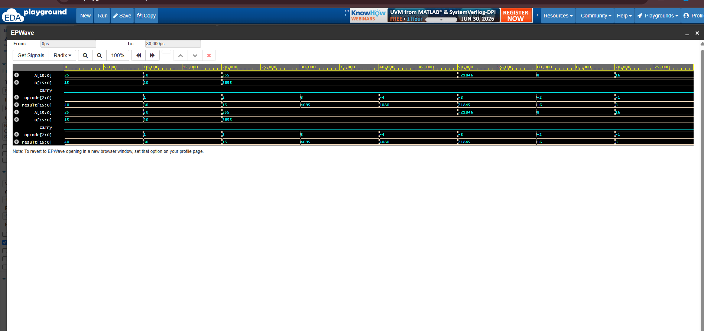

# 16-bit Arithmetic Logic Unit (ALU) using Verilog HDL

## Project Overview

This project implements a **16-bit Arithmetic Logic Unit (ALU)** using **Verilog HDL**. The ALU performs arithmetic and logical operations based on a **3-bit opcode**. The design is functionally verified using a Verilog testbench, and the results are analyzed using **EPWave** in **EDA Playground**.

---

## Features

- 16-bit Combinational ALU
- Verilog HDL Implementation
- Supports 8 Arithmetic and Logical Operations
- Functional Verification using Testbench
- Simulation using EDA Playground
- Waveform Analysis using EPWave

---

## Supported Operations

| Opcode | Operation | Description |
|--------|-----------|-------------|
| 000 | Addition | A + B |
| 001 | Subtraction | A - B |
| 010 | Bitwise AND | A & B |
| 011 | Bitwise OR | A \| B |
| 100 | Bitwise XOR | A ^ B |
| 101 | Bitwise NOT | ~A |
| 110 | Left Shift | A << 1 |
| 111 | Right Shift | A >> 1 |

---

## Module Interface

### Inputs

| Signal | Width | Description |
|--------|-------|-------------|
| A | 16-bit | First input operand |
| B | 16-bit | Second input operand |
| Opcode | 3-bit | Operation Select Signal |

### Outputs

| Signal | Width | Description |
|--------|-------|-------------|
| Result | 16-bit | Output of the selected operation |
| Carry | 1-bit | Carry generated during arithmetic operations |

---

## RTL Design

The ALU is implemented using a combinational `always @(*)` block and a `case` statement. Depending on the opcode, the ALU performs the corresponding arithmetic or logical operation and produces the output without requiring a clock.

---

## Project Directory

```
16-bit-ALU-Verilog/
│
├── alu_16bit.v
├── alu_16bit_tb.v
├── waveform.png
└── README.md
```
├## 📂 Source Files

- [RTL Code](rtl/alu_16bit.v)
- [Testbench](tb/alu_16bit_tb.v)
---

## Simulation

The functionality of the ALU was verified using a Verilog testbench.

### Simulation Waveform

> Upload the waveform image as **waveform.png** in this repository.



---

## Tools Used

| Tool | Purpose |
|------|---------|
| Verilog HDL | RTL Design |
| EDA Playground | Functional Simulation |
| EPWave | Waveform Viewer |
| GitHub | Version Control & Portfolio |

---

## Learning Outcomes

- Verilog HDL Programming
- Combinational Circuit Design
- Arithmetic and Logical Operations
- Case Statement Implementation
- Testbench Development
- Functional Simulation
- Waveform Analysis

---

## Future Enhancements

- Zero Flag
- Overflow Flag
- Negative Flag
- Parity Flag
- Parameterized ALU (8/16/32-bit)
- SystemVerilog Self-Checking Testbench

---

## Author

**Krishna Prasad**

B.Tech – Electronics and Communication Engineering (ECE)

Interested in Digital VLSI, RTL Design and Verification.


